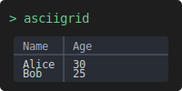

<p align="center">
  
</p>

<h1 align="center">ASCIIGrid</h1>

<p align="center">Render beautiful ASCII tables from JSON and NDJSON directly in your terminal.</p>

<p align="center">
  <!-- Badges (replace shields with your repo links) -->
  <a href="https://github.com/MetalbolicX/ASCIIGrid/actions">
    
  </a>
  <a href="https://www.npmjs.com/package/asciigrid">
    
  </a>
  <a href="https://rescript-lang.org">
    
  </a>
  <a href="https://github.com/MetalbolicX/ASCIIGrid/blob/main/LICENSE">
    
  </a>
  
</p>

---

## 🧭 Table of Contents
- [Description](#description)
- [✨ Features](#-features)
- [🚀 Installation](#-installation)
- [💡 Usage / Quick Start](#-usage--quick-start)
  - [CLI Reference](#cli-reference)
  - [Examples](#examples)
- [🗺️ Roadmap](#-roadmap)
- [🤝 Contributing](#-contributing)
- [📜 License](#-license)

---

## Description

ASCIIGrid converts JSON arrays and NDJSON streams into human-friendly ASCII tables you can view in any terminal. It's optimized for streaming large datasets and provides formatting options that make tabular data easy to scan at a glance.

---

## ✨ Features
- Multiple input formats: JSON arrays and NDJSON (newline-delimited JSON).
- Streaming support: process large NDJSON files line-by-line without loading everything into memory.
- Spreadsheet mode: show column letters (A, B, C...) and row numbers.
- Numeric alignment: right-align numeric values for improved readability.
- Theme support: multiple border themes (mysql, unicode, oracle).
- Rich type preservation: preserve JSON types (numbers, booleans, nulls).

---

## 🚀 Installation

Install globally with npm:

```bash
npm install -g asciigrid
```

> Note: Requires Node.js >= 22.0.0

---

## 💡 Usage / Quick Start

ASCIIGrid accepts input from stdin or a file and renders a formatted ASCII table.

### From stdin

```bash
echo '[["Name","Age"],["Alice","30"],["Bob","25"]]' | asciigrid
```

### From file

```bash
asciigrid --input data.json
```

### NDJSON streaming

```bash
cat records.ndjson | asciigrid --format ndjson
```

---

### CLI Reference

| Flag | Description | Default |
|------|-------------|---------|
| `-i, --input <file>` | Input file path | stdin |
| `-f, --format <fmt>` | Input format: `json` or `ndjson` | `json` |
| `-t, --title <text>` | Table title | - |
| `-p, --padding <n>` | Cell padding (spaces on each side) | `1` |
| `-H, --no-header` | Disable header separator | - |
| `-s, --spreadsheet` | Enable spreadsheet labels | - |
| `-a, --align` | Right-align numeric values | - |
| `-T, --theme <name>` | Border theme: `mysql`, `unicode`, `oracle` | `mysql` |
| `-o, --output <file>` | Write output to file | stdout |
| `-v, --verbose` | Enable verbose output | - |
| `--timeout <sec>` | Timeout for stdin (0 = disabled) | `0` |
| `--max-rows <n>` | Maximum rows to process | `100000` |
| `--max-line-bytes <n>` | Maximum bytes per NDJSON line | `10000000` |
| `--rich` | Preserve JSON value types | - |
| `-h, --help` | Show help | - |
| `--version` | Show version | - |

---

## Examples

### Basic Table

```bash
echo '[["Name","City"],["Alice","NYC"],["Bob","LA"]]' | asciigrid
```

```
+-------+-------+
| Name  | City  |
+-------+-------+
| Alice | NYC   |
| Bob   | LA    |
+-------+-------+
```

### With Title

```bash
echo '[["Name","Age"],["Alice","30"],["Bob","25"]]' | asciigrid --title "Users"
```

```
+--------------------+
|       Users        |
+-------+-----+------+
| Name  | Age | City |
+-------+-----+------+
| Alice | 30  | NYC  |
| Bob   | 25  | LA   |
+-------+-----+------+
```

### Spreadsheet Mode

```bash
echo '[["Name","Age"],["Alice","30"]]' | asciigrid --spreadsheet
```

```
+---+-------+-----+------+
|   | A     | B   | C    |
+---+-------+-----+------+
| 0 | Name  | Age | City |
+---+-------+-----+------+
| 1 | Alice | 30  | NYC  |
+---+-------+-----+------+
```

### Unicode Theme

```bash
echo '[["Name"],["Alice"]]' | asciigrid --theme unicode
```

```
╔═══════╗
║ Name  ║
╠═══════╣
║ Alice ║
╚═══════╝
```

### NDJSON Streaming

```bash
echo '{"name":"Alice","age":30}
{"name":"Bob","age":25}' | asciigrid --format ndjson
```

### Numeric Alignment

```bash
echo '[["Item","Price"],["Apple",42],["Banana",7]]' | asciigrid --align
```

```
+--------+-------+
| Item   | Price |
+--------+-------+
| Apple  |    42 |
| Banana |     7 |
+--------+-------+
```

### Rich Type Preservation

```bash
echo '[["value"],[30],[22.5],[true],[null]]' | asciigrid --rich
```

```
+-------+-------+
| value |       |
+-------+-------+
|    30 |       |
|  22.5 |       |
|  true |       |
|       |       |
+-------+-------+
```

### Timeout

```bash
# Will timeout after 5 seconds of no input
cat | asciigrid --timeout 5
```

### Max Rows Guardrail

```bash
# Reject input larger than 10k rows
cat records.ndjson | asciigrid --format ndjson --max-rows 10000
```

---

## Input Formats

### JSON Array

```json
[ ["Name", "Age"], ["Alice", "30"], ["Bob", "25"] ]
```

### JSON Array of Objects

```json
[ {"name": "Alice", "age": 30}, {"name": "Bob", "age": 25} ]
```

### NDJSON

```
{"name": "Alice", "age": 30}
{"name": "Bob", "age": 25}
```

---

## Exit Codes

- `0`: Success
- `1`: Invalid argument (format, theme, etc.)
- `2`: Parse error (invalid JSON/NDJSON)
- `3`: Render error (invalid data shape)
- `4`: Unexpected error
- `124`: Timeout
- `130`: Interrupted (SIGINT)
- `143`: Terminated (SIGTERM)

---

## 📜 License

ASCIIGrid is released under the MIT License. See the [LICENSE](LICENSE) file for details.
